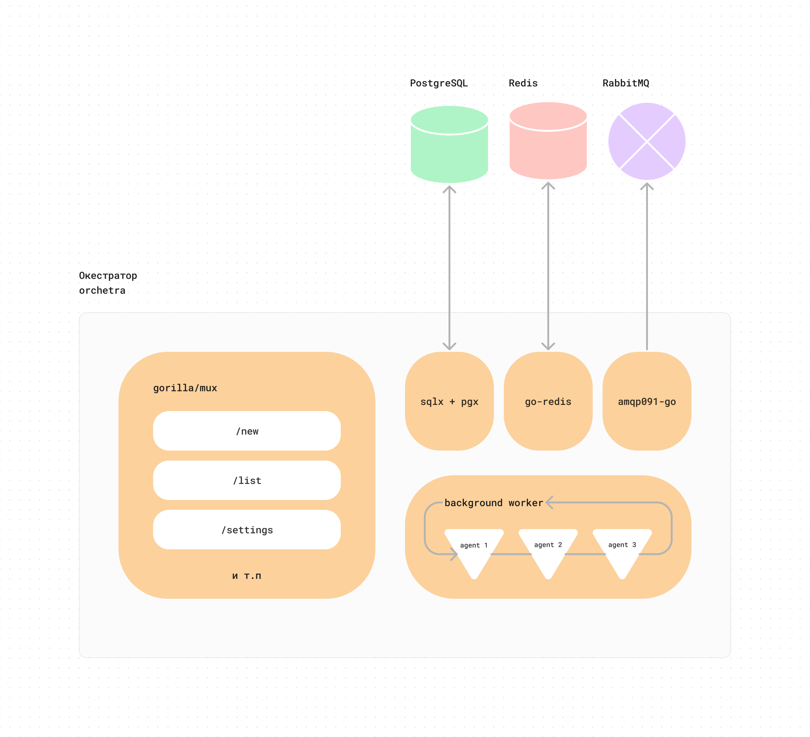
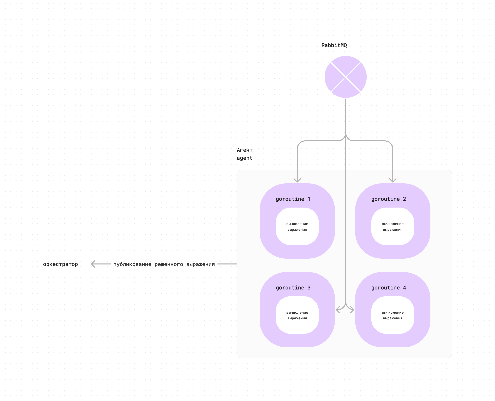
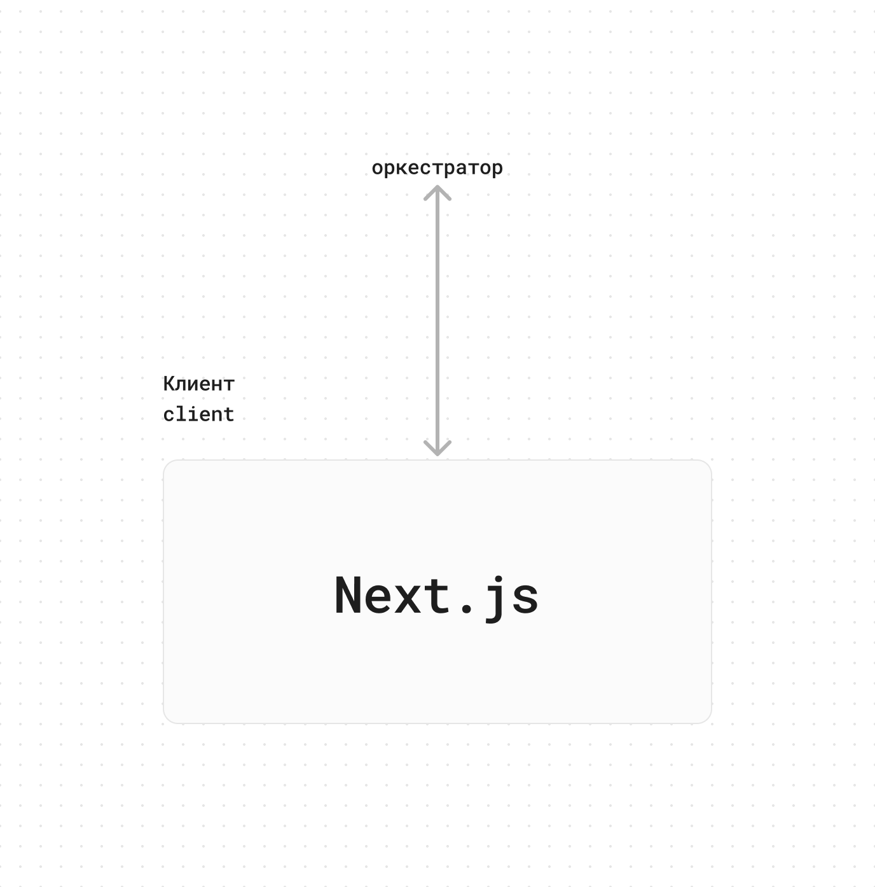

# Expressionist

Проект для Лицея Академии Яндекс

### !!! Я еще дополняю документацию

### В случае ошибки или при любых других вопросах пишите сюды [@moolcoov](https://moolcoov.t.me/)

## Установка

#### Docker

Для начала на вашем компьютере должен быть установлен [Docker](https://docker.com). Как его установить написано в [документации](https://docs.docker.com/get-docker/).

#### Клонирование репозитория

Далее необходимо склонировать репозиторий с кодом

```bash
git clone https://github.com/moolcoov/expressionist.git
```

#### Build

После этого нужно создать билд с помощью Docker Compose

```bash
docker-compose build
```

P.S Этот процесс может занять довольно много времени ☕

## Запуск

После этого можно запускать проект

Для того чтобы запустить все сервисы:

```bash
docker-compose up
```

Для того чтобы запустить еще агентов:

```bash
docker-compose scale agent=3
```

Вместо 3 можно подставить любое число, сколько агентов вы хотите.

После этого можно открыть [localhost:3000](http://localhost:3000) для доступа к веб-версии или получить доступ к оркестратору через [localhost:8080](http://localhost:8080)

## На чем оно написано

### 1. Оркестратор

Оркестратор находится в директории [`/orchestra`](https://github.com/moolcoov/expressionist/tree/main/orchestra). Написан на Go.

#### Роутинг

Для роутинга изпользуется [gorilla/mux](https://github.com/gorilla/mux). Все эндпоинты в субдиректории [`/routes`](https://github.com/moolcoov/expressionist/tree/main/orchestra/routes).

#### База данных

База данных, в которую сохраняются выражения: [PostgreSQL](https://www.postgresql.org/). Для доступа используется [sqlx](https://github.com/jmoiron/sqlx) с драйвером [pgx](https://github.com/jackc/pgx). Файл, в котором происходит подключение к бд [`/lib/postgres.go`](https://github.com/moolcoov/expressionist/blob/main/orchestra/lib/postgres.go).

#### Кэш

Для кэширования результатов используется key-value база данных [Redis](https://redis.io/). Для подключения применяется пакет [`go-redis`](github.com/redis/go-redis). Файл, в котором происходит подключение [`/lib/redis.go`](https://github.com/moolcoov/expressionist/blob/main/orchestra/lib/redis.go)

#### Связь с агентами

Для передачи выражений агентам используется [RabbitMQ](https://rabbitmq.com/). Для подключения применяется [`amqp091-go`](https://github.com/rabbitmq/amqp091-go). Файл [`/lib/redis.go`](https://github.com/moolcoov/expressionist/blob/main/orchestra/lib/rabbitmq.go).

#### Проверка активности агентов

Активность агентов проверяется в отдельной горутине с бесконечным циклом, которая каждые 10 секунд проверяет, не истекло ли время пинга у агентов.

```go
go func() {
    for {
        agent.Agents.CheckAgents()
        time.Sleep(10 * time.Second)
    }
}()
```

Схема оркестратора в конце концов выглядит так:



### 2. Агенты

Агент находится в директории [`/agent`](https://github.com/moolcoov/expressionist/tree/main/agent). Написан на Go.

#### Получение выражений

Агент получает выражения с помощью того же [RabbitMQ](https://rabbitmq.com/). Схема подключения такая же, как и у оркестратора. [`/lib/redis.go`](https://github.com/moolcoov/expressionist/blob/main/agent/lib/rabbitmq.go).

#### Вычисление

Для вычисления используется измененная версия библиотеки [go-shunting-yard](https://github.com/mgenware/go-shunting-yard).

Схема:



### 3. Клиент

Фронтенд написан на [Typescript](https://www.typescriptlang.org/), с использованием фреймворка [Next.js](https://nextjs.org). Находится в директории [`/client`](https://github.com/moolcoov/expressionist/tree/main/client).

#### Запросы к оркестратору

На серверной части запросы делаются с помощью официального API (добавление нового выражения, обновление настроек).

```ts
const res = await fetch(... ,{})
```

На клиентской части используется библиотека [SWR](https://swr.vercel.app/) (получение списка выражений, агентов, настроек).

```ts
const { data, error, isLoading } = useSWR(..., fetcher)
```

Схема:



## Как оно работает

### Запуск

Все настройки для PostgreSQL, Redis, RabbitMQ и т.д. находятся в файле [`.env`](https://github.com/moolcoov/expressionist/blob/main/.env)

#### Оркестратор

При запуске оркестратор подключается к PostgreSQL (создает таблицу, если ее нет), Redis, открывает канал RabbitMQ. Также он объявляет настройки, которые получает из Redis под ключом `_settings`. (Если в редисе значений нет, он их создает).

После этого оркестратор объявляет эндпоинты, запускает проверку агентов и начинает обрабатывать запросы.

#### Агент

При запуске агент генерирует uuid, регистрирует его у оркестратора, получает настройки, подключает RabbitMQ.

Далее запускает `n` горутин, с бесконечным циклом. \
`n` определяется в переменной среды `AGENT_GOROUTINES` в файле [`.env`](https://github.com/moolcoov/expressionist/blob/main/.env).

В горутинах начинается принятие и обработка выражений. Также запускается горутина, которая пингует оркестратор и обновляет настройки, с задержкой в `30` секунд

#### Клиент

При запуске начинает обрабатывать запросы пользователя.
